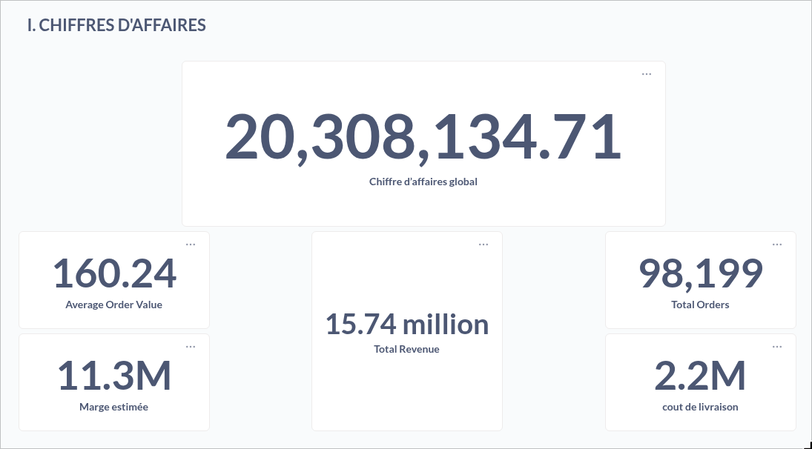
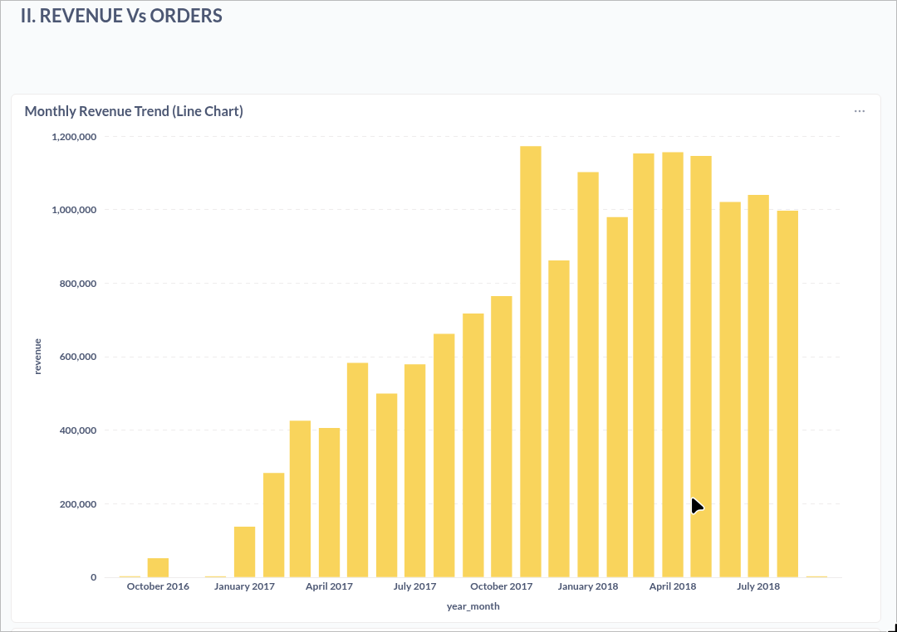
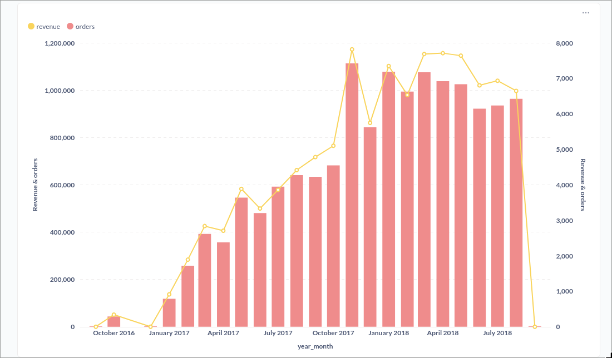
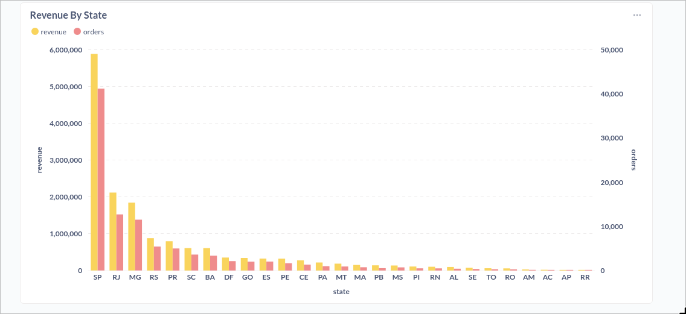
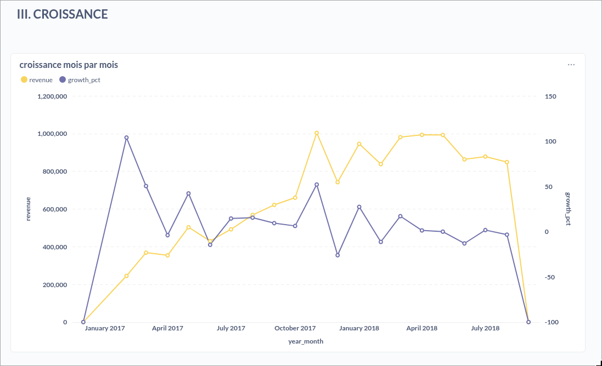
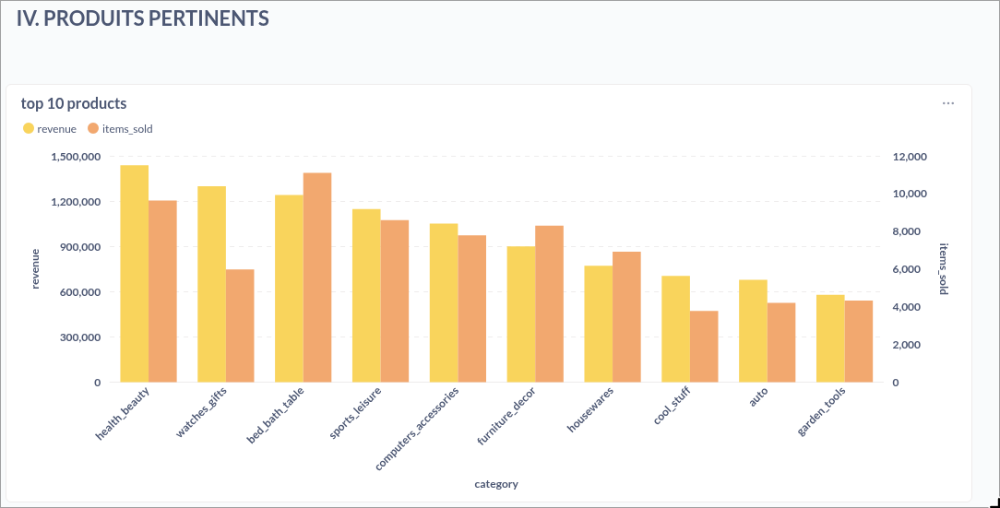
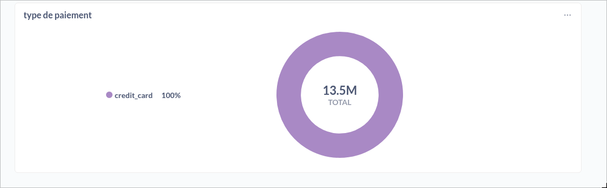
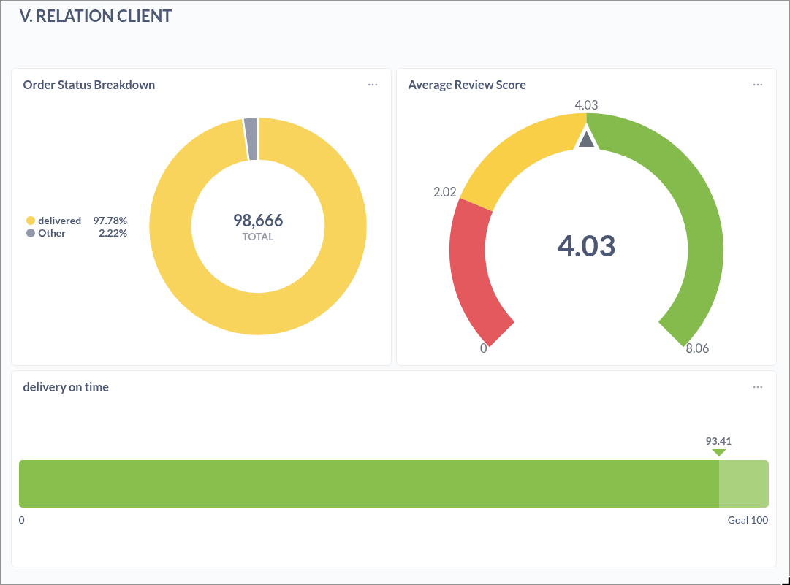
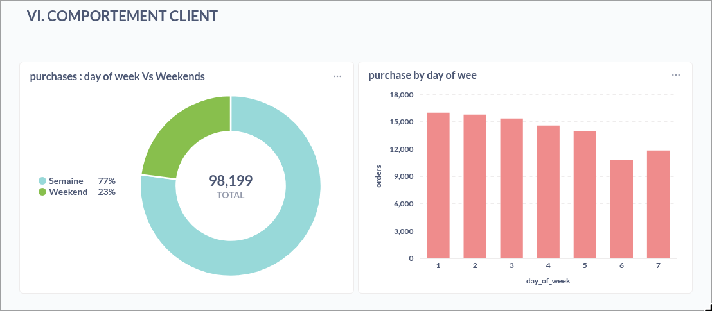

# Streaming Sales Analytics — Data Warehouse

A fully containerized, end-to-end streaming data warehouse built on the **Brazilian Olist e-commerce dataset**. The pipeline ingests real-time transactional events, processes them through a medallion architecture, and surfaces business insights via interactive dashboards and Machine Learning models.

---

## Architecture Overview

```
Olist CSV Data
      │
      ▼
  Producer (Python)
      │  Kafka topics (Redpanda)
      ├──────────────────────┐
      ▼                      ▼
Consumer Postgres      Consumer ClickHouse
  (OLTP layer)          (OLAP layer)
                              │
                         Airflow DAGs
                    (Bronze → Silver → Gold)
                              │
                    ┌─────────┴──────────┐
                    ▼                    ▼
              Metabase               ML Module
            Dashboards        (Gradient Boosting,
                               K-Means RFM,
                               Isolation Forest)
```

**Stack:** Redpanda · ClickHouse · PostgreSQL · Apache Airflow · Metabase · Python · Docker Compose

---

## Tech Stack

| Layer | Technology |
|---|---|
| Message Broker | Redpanda (Kafka-compatible) |
| OLTP Store | PostgreSQL 15 |
| OLAP Store | ClickHouse (Medallion: Bronze/Silver/Gold) |
| Orchestration | Apache Airflow |
| Visualization | Metabase |
| ML | scikit-learn (Gradient Boosting, K-Means, Isolation Forest) |
| Infrastructure | Docker Compose |

---

## Medallion Architecture (ClickHouse)

```
Bronze  →  Raw ingested events (append-only)
Silver  →  Cleaned, deduplicated, typed
Gold    →  Star schema with ClickHouse Dictionaries for high-performance joins
```

The Gold layer exposes a star schema (`fact_orders`, `dim_customer`, `dim_product`, `dim_date`, `dim_seller`) optimized for analytical queries via ClickHouse's dictionary engine.

---

## Dashboards (Metabase)

### KPIs — Chiffres d'affaires

> **$20.3M** total revenue · **98,199** orders · **$160** average order value



---

### Revenue vs Orders — Monthly Trend





---

### Revenue by State (Brazil)

SP dominates with **$5.8M** in revenue and **41,000+** orders. Strong concentration in the southeast.



---

### Growth Rate (MoM)

Month-over-month revenue growth tracked alongside absolute revenue.



---

### Top 10 Product Categories

Health & Beauty, Watches, and Bed/Bath lead both revenue and volume.



---

### Payment Behavior

100% credit card adoption across **13.5M** in payment volume.



---

### Customer Relations

- **97.78%** delivery rate · **4.03/5** average review score · **93.41%** on-time delivery



---

### Purchase Behavior

77% of orders placed on weekdays, with Monday–Wednesday being peak days.



---

## Machine Learning Module

Three models are trained and their outputs written back into ClickHouse for direct use in dashboards:

| Model | Algorithm | Output |
|---|---|---|
| Sales Forecasting | Gradient Boosting | Monthly revenue predictions |
| Customer Segmentation | K-Means (RFM) | Customer segments (Champions, At Risk, etc.) |
| Anomaly Detection | Isolation Forest | Flagged suspicious transactions |

---

## Getting Started

### Prerequisites
- Docker & Docker Compose
- Python 3.10+

### Run

```bash
# Start all services
docker compose up -d

# Monitor PostgreSQL ingestion
watch -n 5 "docker exec oltp_postgres psql -U admin -d \"e-commerce\" -c \
  'SELECT (SELECT COUNT(*) FROM orders) AS orders, \
          (SELECT COUNT(*) FROM order_items) AS order_items, \
          (SELECT COUNT(*) FROM order_payments) AS order_payments, \
          (SELECT COUNT(*) FROM order_reviews) AS order_reviews;'"

# Monitor ClickHouse ingestion
watch -n 5 "docker exec olap_clickhouse clickhouse-client \
  --user admin --password admin \
  --query \"
    SELECT 'bronze_orders'       AS table, count() AS rows FROM ecommerce_dw.bronze_orders
    UNION ALL SELECT 'bronze_order_items',    count() FROM ecommerce_dw.bronze_order_items
    UNION ALL SELECT 'bronze_order_payments', count() FROM ecommerce_dw.bronze_order_payments
    UNION ALL SELECT 'bronze_order_reviews',  count() FROM ecommerce_dw.bronze_order_reviews
  \""
```

### Service URLs

| Service | URL |
|---|---|
| Redpanda Console | http://localhost:8080 |
| Airflow | http://localhost:8081 |
| Metabase | http://localhost:3000 |
| pgAdmin | http://localhost:5050 |

---

## Dataset

[Brazilian E-Commerce Public Dataset by Olist](https://www.kaggle.com/datasets/olistbr/brazilian-ecommerce) — 100k orders from 2016 to 2018 across multiple marketplaces in Brazil.

---

## Project Contributors

**Bensmina Anass**
**Bellil Zakariae**
**Benaqqa Moubarak**
**El Akkioui Aymane**
